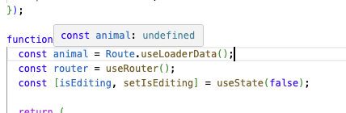

# REVIEW.md

## 08/05 Peter

- Fix typing errors ($id.tsx)
- Avoid duplicated tsx code

```jsx
<div className="grid gap-2">
    <Label htmlFor={field.name}>Name</Label>
    <Input
        id={field.name}
        name={field.name}
        type="text"
        value={field.state.value}
        onBlur={field.handleBlur}
        onChange={(e) => field.handleChange(e.target.value)}
        aria-invalid={!field.state.meta.isValid}
        maxLength={100}
    />
    {!field.state.meta.isValid && field.state.meta.errors.length > 0 && (
        <p className="text-sm text-destructive">{formatFieldErrors(field.state.meta.errors)}</p>
    )}
</div>
```

better 

```jsx
<div className="grid gap-2">
    <Label htmlFor={field.name}>Name</Label>
    <Input
        id={field.name}
        name={field.name}
        value={field.state.value}
        onBlur={field.handleBlur}
        onChange={(e) => field.handleChange(e.target.value)}
        aria-invalid={!field.state.meta.isValid}
        maxLength={100}
    />
    <FieldError field={field} />
</div>
```

en 

```js
function FieldError({ field }: { field: { state: { meta: { isTouched: boolean; errors: Array<unknown> } } } }) {
  if (!field.state.meta.isTouched || field.state.meta.errors.length === 0) return null;
  const message = field.state.meta.errors
    .map((err) => (typeof err === 'string' ? err : (err as { message?: string })?.message))
    .filter(Boolean)
    .join(', ');
  if (!message) return null;
  return <p className="text-sm text-destructive">{message}</p>;
}
```

- Give component there own file, the $id.tsx becomes to large

```
/components
  field-error.tsx
/routes
  /animals
    /components
      animal-detail.tsx
      animal-form.tsx
    $id.tsx
    index.tsx
```

You can also place the schema in a separated files to its clean to test and re-use them

```
/animals
    /components
      animal-detail.tsx
      animal-form.tsx
      form-schema.ts
      form-schema.spec.ts
    $id.tsx
    index.tsx
```

- Make sure important data in the page is typed for `Route.useLoaderData`



```js
// improved fetchAnimal with correct typing
const fetchAnimal = createServerFn({ method: 'GET' })
  .inputValidator((id: number) => id)
  .handler(async ({ data: id }): Promise<AnimalDTO> => {
    const { data, error } = await getAnimalById(id);
    if (error || !data) throw new Error('Failed to get animal');
    return data;
  });
```

- Enable more strict openapi specs, better for the TS types generation.
  and make sure all field are not optional (default for C#)

```c#
builder.Services.ConfigureHttpJsonOptions(options =>
{
    options.SerializerOptions.NumberHandling = JsonNumberHandling.Strict;
});

builder.Services.AddOpenApi(options =>
{
    options.AddSchemaTransformer((schema, _, _) =>
    {
        if (schema.Properties is { Count: > 0 })
        {
            schema.Required ??= new HashSet<string>();
            foreach (var (name, property) in schema.Properties)
            {
                var isNullable = property.Type is { } t && (t & JsonSchemaType.Null) != 0;
                if (!isNullable)
                {
                    schema.Required.Add(name);
                }
            }
        }
        return Task.CompletedTask;
    });
});
```


